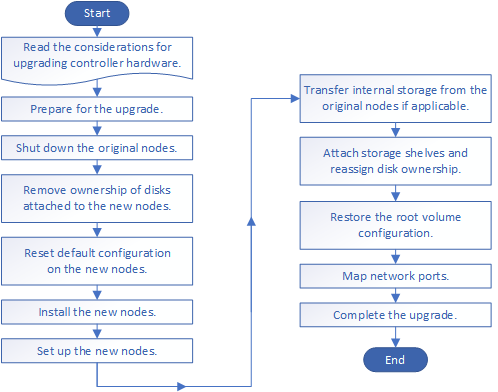

= Upgrade controller hardware by moving storage
:icons: font
:imagesdir: ../media/

[.lead]
If you are upgrading by moving storage, you prepare the original nodes and set up the new nodes. Some platform models support transferring internal storage to the new nodes. You reassign disks and restore root volume configuration to the new nodes and configure network ports. Upgrading by moving storage is a disruptive procedure.

.Steps
. xref:upgrade-prepare-when-moving-storage.adoc[Prepare for the upgrade when moving storage]
. xref:upgrade-shutdown-remove-original-nodes.adoc[Shut down the original nodes]
. xref:upgrade-remove-disk-ownership-new-nodes.adoc[Remove ownership of disks attached to the new nodes]
. xref:upgrade-reset-default-configuration-node3-and-node4.adoc[Reset the default configuration on the new nodes]
. xref:upgrade-install-new-nodes.adoc[Install the new nodes]
. xref:upgrade-set-up-new-nodes.adoc[Set up the new nodes]
. xref:upgrade-optional-move-internal-storage.adoc[Optional: Move internal storage or convert the system to a drive shelf]
. xref:upgrade-attach-shelves-reassign-disks.adoc[Attach storage shelves and reassign disk ownership]
. xref:upgrade-restore-root-volume-config.adoc[Restore the root volume configuration]
. xref:upgrade-complete.adoc[Complete the upgrade]
